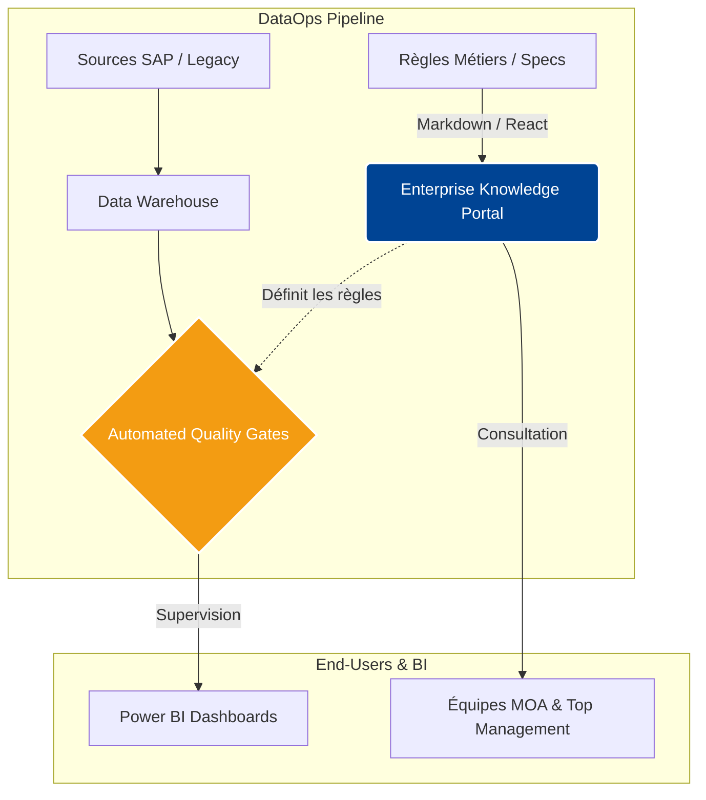

# Enterprise-Knowledge-Framework-Architecture-DataOps-Industrialisation

🇺🇸 A DataOps "Docs-as-Code" framework designed to centralize business rules and automate technical documentation for national-scale data products.
🇫🇷 Un socle DataOps conçu pour centraliser les règles de gestion et industrialiser la documentation des produits data (Approche Docs-as-Code).

*(🔒 Note : Code source et données métiers strictement privés. Ce dépôt présente uniquement l'architecture système et l'approche Produit du portail de documentation interne).*

---

## 📉 1. Business Context / Le Problème Métier
Dans les environnements data à grande échelle, la décentralisation des règles de gestion, des dictionnaires de données et des spécifications techniques ralentit considérablement le "Time-to-Market". Sans un référentiel technique unique (*Single Source of Truth*), le paramétrage des contrôles de qualité automatisés devient laborieux, et les équipes Data perdent un temps précieux à chercher ou vérifier l'information.

## 💡 2. The Solution / La Solution : Approche "Docs-as-Code"
Conception et déploiement d'un portail documentaire centralisé (GPS MOA) intégré directement dans la boucle **DataOps**.
* **Single Source of Truth :** La documentation centralisée fait désormais foi pour le paramétrage des contrôles qualité automatisés (*Quality Gates*) et la supervision dans Power BI.
* **Périmètre Métier :**
  * 🧠 **IA & Matching :** Documentation des algorithmes de recommandation.
  * 💶 **Données Financières :** Suivi strict des référentiels d'allocations à l'échelle nationale.
* **Accessibilité :** Traduction de règles complexes (SQL / SAS) en documentation lisible pour les équipes de Maîtrise d'Ouvrage (MOA).

---

## 🏗️ 3. System Architecture / Architecture du Système

Le schéma ci-dessous illustre comment le portail de documentation s'insère dans le pipeline global de données :



🛠️ 4. Tech Stack & Project Structure / Stack Technique

Framework : Docusaurus v3 (React / TypeScript / Markdown).

UI/UX : Thème institutionnel (Wide Mode) optimisé pour l'affichage de tables de données massives.

Fonctionnalités avancées : Rendu de code multi-langages (SQL / SAS) et versioning natif des roadmaps.

### 📂 Structure Modulaire (Exemple d'architecture)
*L'architecture est pensée pour l'évolutivité et l'intégration continue.*

```text
📂 enterprise-docs-framework/
 ┣ 📂 docs/
 ┃ ┣ 📂 ia-matching/       # Spécifications des modèles ML
 ┃ ┗ 📂 financial-data/    # Dictionnaires de données et règles de calcul
 ┣ 📂 src/                 # Composants React/TS personnalisés (Tags, Filtres)
 ┣ 📜 docusaurus.config.js # Configuration globale et gestion SSO
 ┗ 📜 package.json
```


🚀 5. Corporate Challenges / Enjeux & Contraintes Résolues

🛡️ Gouvernance & Versioning : Traçabilité complète des évolutions data grâce à un journal d'audit intégré (Changelog natif).

🔐 Sécurité & Résilience (Network Proxy) : Produit entièrement configuré et déployé sous de fortes contraintes réseau d'entreprise (SSO, Proxy stricts, air-gapped environments).

💻 Local Deployment (Usage interne uniquement)

⚠️ ATTENTION - CONTRAINTE RÉSEAU (PROXY) ⚠️

Ce projet est conçu pour un environnement d'entreprise restreint par un proxy strict. L'installation de paquets externes non approuvés (npm install) est bloquée par les protocoles de sécurité. Utilisez la configuration validée.

**Prérequis :** Node.js (v18+) & NPM.

```bash
# Démarrer le serveur de développement en local
npm start
```

